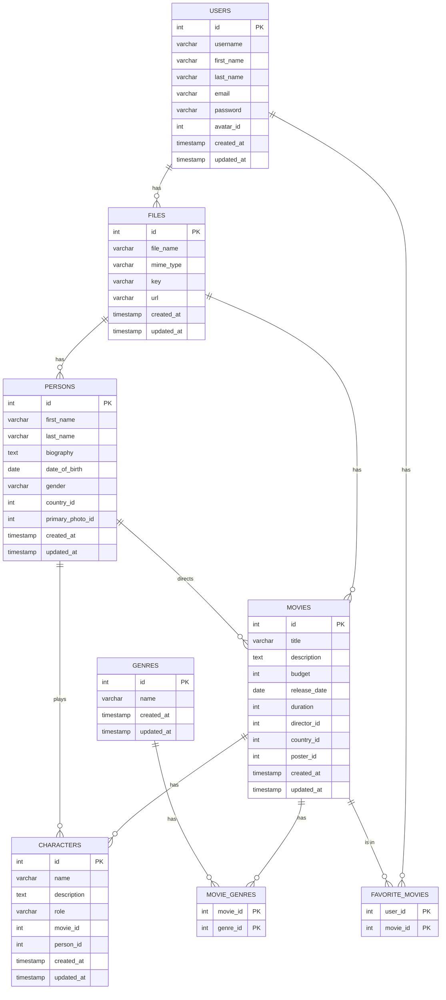

# Movies App

This project is a simplified database for a movie application. It includes the database structure, ER diagram, and SQL queries.

## ER Diagram



## Project structure

movies_app_sql/  
├── README.md  
├── queries/  
│   ├── 1_select_actors_with_total_movies_budget.sql  
│   ├── 2_select_movies_released_in_last_5_years_with_actors_count.sql  
│   ├── 3_select_users_with_favorite_movies.sql  
│   ├── 4_select_directors_with_average_movie_budget.sql  
│   ├── 5_select_movies_by_criteria.sql  
│   ├── 6_select_movie_details_by_id.sql  
├── ddl/  
│ ├── create_tables.sql  
│ ├── seed_data.sql  
├── package.json  
└── node_modules/  

## Setup

Install dependencies:
  ```sh
  npm install
  ```

### Executing SQL Scripts

1. Create the tables:
   ```sh
   psql -U postgres -c "CREATE DATABASE movies_db;"
     ```
2. Fill the database with test data:
     ```sh
     psql -U postgres -d movies_db -f ddl/seed_data.ddl
     ```


## Using
To run SQL queries, use:
```sh
psql -U postgres -d movies_db -f queries/1_select_actors_with_total_movies_budget.ddl

``` 

... and other